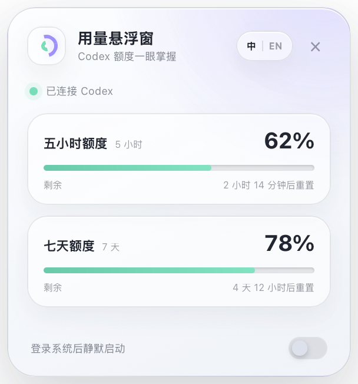

# Codex Usage Dock

An unofficial, privacy-first floating usage monitor for Codex on macOS and Windows.

Codex Usage Dock sits in the bottom-right corner of the active Codex window and shows the two limits people check most often:

- five-hour remaining percentage and reset countdown;
- seven-day remaining percentage and reset countdown.

It hides when you switch to another application, so it never floats over unrelated work.
Drag the header to place it somewhere else relative to Codex, or collapse it into a small bottom-right icon and click once to restore the full panel.

> 非官方 Codex 用量悬浮窗。支持 macOS 和 Windows，默认放在 Codex 右下角，可拖动，也可收起为小图标；显示五小时与七天周期的剩余百分比，切换到其他软件后自动隐藏。



Use the `中 / EN` control to switch languages. The choice is stored locally.

## How it works

The desktop companion launches the local `codex app-server`, initializes the documented JSONL protocol, reads `account/rateLimits/read`, and listens for `account/rateLimits/updated` notifications. It selects the overall `codex` bucket, recognizes the two windows by their server-provided durations (300 and 10,080 minutes), and displays `100 - usedPercent` as the remaining quota.

No API key is required. Usage and account data stay on the computer.

## Install

Download the latest installer from [GitHub Releases](https://github.com/Nossen/codex-usage-dock/releases/latest):

- macOS: `.dmg`
- Windows: `.exe` (NSIS) or `.msi`

The first packaged launch enables a quiet system sign-in entry. You can turn it off from the dock.

Codex or ChatGPT must already be installed and signed in. If automatic Codex binary discovery fails, set `CODEX_USAGE_DOCK_CODEX_BIN` to the full path of the local `codex` executable.

## Install the Codex plugin

The optional plugin lets Codex launch and troubleshoot the desktop companion:

```bash
codex plugin marketplace add https://github.com/Nossen/codex-usage-dock
codex plugin add codex-usage-dock@codex-usage-dock
```

Start a new Codex task after installation so the plugin is loaded.

## Development

Prerequisites: Node.js 22+, Rust stable, and the platform requirements for Tauri 2.

```bash
npm install
npm run check
cargo test --manifest-path src-tauri/Cargo.toml
CODEX_USAGE_DOCK_ALWAYS_VISIBLE=1 npm run tauri dev
```

`CODEX_USAGE_DOCK_ALWAYS_VISIBLE=1` keeps the panel visible for UI development. Without it, the panel appears only while Codex or ChatGPT is the foreground application.

## Release

Push a semantic version tag such as `v0.2.0`. GitHub Actions builds a universal macOS image and Windows installers, then attaches them to the release.

Unsigned development builds may trigger macOS Gatekeeper or Windows SmartScreen. Production distribution should add Apple Developer ID and Windows code-signing secrets.

## Privacy and permissions

- Reads quota percentages and reset timestamps from the local Codex App Server.
- Reads the foreground window process name and bounds to position the dock.
- Does not read prompts, source code, files, or conversation content.
- Does not send telemetry or usage data to this project.

On macOS, the system may request Screen Recording permission so window bounds can be read. The app does not capture or store screenshots.

## License

[MIT](LICENSE)
